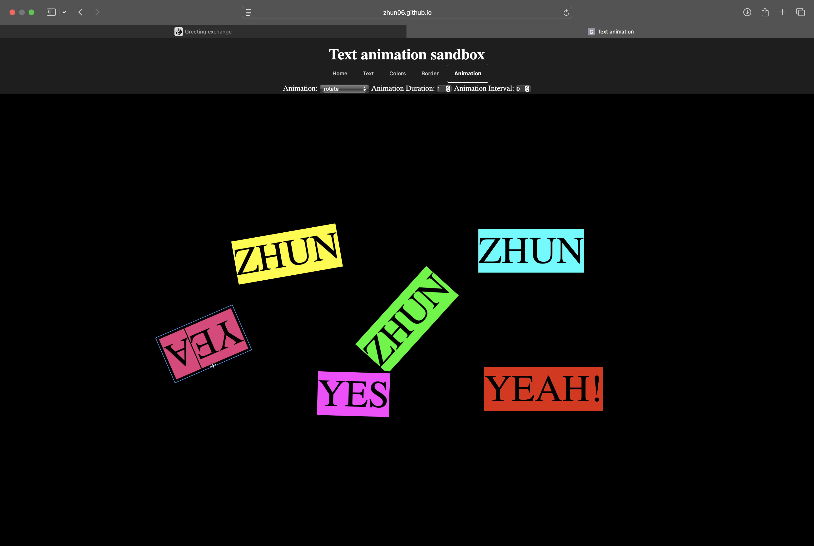

# ✨ Text Animation Sandbox

A multi-text animation sandbox built to explore CSS properties, visual effects and UI interaction.

🌐 Live Demo: https://zhun06.github.io/text-animation-sandbox/

<video src="assets/demo.mp4" controls width="800"></video>

---

## 🚀 Overview

Text Animation Sandbox is a browser-based playground for creating and experimenting with animated text.

The project started as a single-text sandbox and was later redesigned into a multi-text system after revisiting the codebase and applying object-oriented design concepts learned from my Tetris refactor project.

The goal was to better understand how real creative tools manage multiple elements, styling and interaction.

---

## ✨ Features

- Multi-text editing
- Drag and position text on canvas
- Text styling (font, size, outline, etc.)
- Border styling
- Color controls
- CSS-based animations
- Interactive controls for each text object
- Modular object model for scalability

---

## 🛠 Tech Stack

- HTML  
- CSS  
- Vanilla JavaScript  

No frameworks — focused on fundamentals, DOM architecture and state management.

---

## 🧠 What I Learned

- Managing multiple UI elements using an object-oriented approach  
- Separating state, rendering and interaction logic  
- Handling pointer events for drag interactions  
- Working with computed styles and layout measurements  
- Designing reusable text object abstractions  
- Refactoring a prototype into a scalable system  